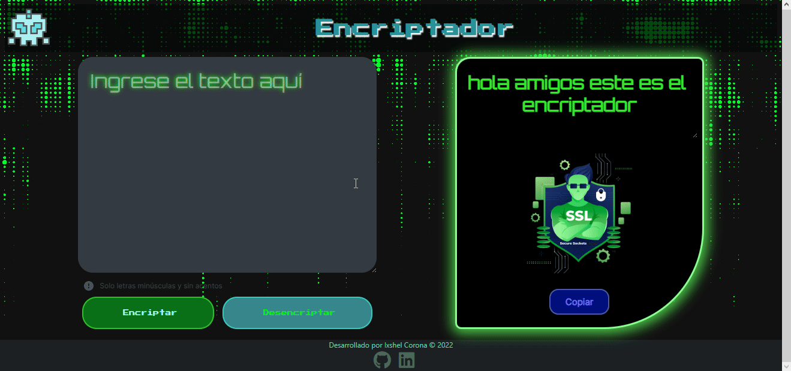

<h1 align="center" > Challenge-Oracle-ONE  👾 Encriptador 👾</h1>

> <p align="center" > El desafío consistió en crear un encriptador de texto.</p>

## 🗒️ Descripción

Las "llaves" de encriptación que utilizaremos son las siguientes:

* `La letra "e" es convertida para "enter"`
* `La letra "i" es convertida para "imes"`
* `La letra "a" es convertida para "ai"`
* `La letra "o" es convertida para "ober"`
* `La letra "u" es convertida para "ufat"`

## 📜 Requisitos

* Debe funcionar solo con letras minúsculas
* No deben ser utilizados letras con acentos ni caracteres especiales
* Debe ser posible convertir una palabra para la versión encriptada también devolver una palabra encriptada para su versión original.

*Por ejemplo:*

``````
"gato" => "gaitober"
"gaitober" => "gato"
``````

<h2 align="center">🔐 Visualización del encriptador 🔐</h2>

### 🖥 Encriptador versión Desktop

<p align="Center"> </p>

### 📲 Encriptador versión móvil

<p align="Center"> </p>

## 📦 Despliegue

* 🔗[Encriptador](https://ixshelc.github.io/Challenges-Oracle-ONE/Encriptador/index.html)

## 🛠 Tecnologías utilizadas

* HTML5
* CSS3
* JavaScript

## 🏆 Insignia
<p align="center">  </p>

## Contacto

<a href="https://www.linkedin.com/in/ixshelcorona-ti/"></a>  <a href="https://www.instagram.com/ixicrown/?next=%2F"></a>  <a href="https://www.facebook.com/profile.php?id=100081261308881"></a>


<hr>

Desarrollado con ❤️ por [IxshelCorona](https://github.com/IxshelC) 👽

